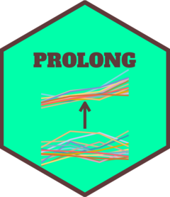

<!-- README.md is generated from README.Rmd. Please edit that file -->

```{r, include = FALSE}
knitr::opts_chunk$set(
  collapse = TRUE,
  comment = "#>",
  fig.path = "man/figures/README-",
  out.width = "100%"
)
```

# prolong

<!-- badges: start -->
<!-- badges: end -->

The primary purpose of `prolong` is to facilitate penalized modeling of high-dimensional longitudinal omics data with a longitduinal clinical outcome to obtain a sparse set of omics variables that co-vary with the outcome over time. `prolong` also provides functionality in both R and in a point-and-click GUI shiny app for plots that reveal the underlying correlation structure of the omics variables. For more information, visit the [package website](https://stevebroll.github.io/prolong/).

<a href="https://stevebroll.github.io/prolong/"></a>


A preview of the shiny app that is being continuously updated is available at the following link:
[Shiny App](https://stevebroll-cornell.shinyapps.io/TBcorr/)


## Installation

You can install the development version of prolong from [GitHub](https://github.com/) with:

``` r
# install.packages("devtools")
devtools::install_github("stevebroll/prolong")
```


